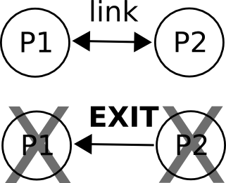
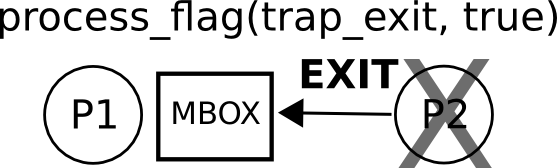
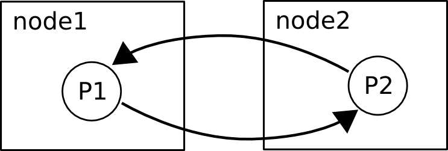
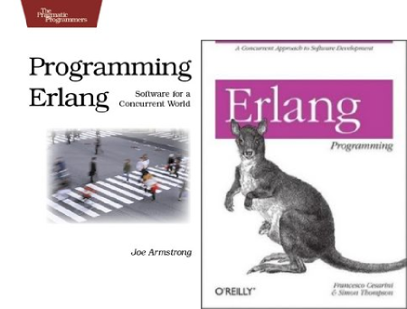

#SLIDE

<image src="http://erlang.org/images/erlang-logo.png" alt="Erlang"></image>
 
## do geeks dream of concurrent sheeps?

<small>Luca Greco &lt;luca.greco@alcacoop.it&gt;</small>

# LinuxDay2010

#SLIDE

## Erlang...

* created at ericsson for its telco devices
* designed for concurrent / fault tolerant software

#SLIDE

## And now...

* ejabberd, couchdb, rabbitmq...
* erlang solutions, basho, github, processone,   facebook, google, amazon...

#SLIDE

# Ok... wait... but...

## Why should I learn erlang?!?!

#SLIDE

## Reason 0.

You can look at this page for a while...

## YOU WANT 

<iframe src="animation.html" style="width: 500px; height: 400px; border: 0;">
</iframe>

## TO LEARN ERLANG

#SLIDE

## Reason 1.

You are already using some erlang software:

* EJabberd
* CouchDB
* RabbitMQ
* ...

#SLIDE 

## Reason 2.

You are interested to learn

## how to handle concurrency

from an erlang point of view

#SLIDE

Learn the syntax is not enough

## we have to learn new Paradigms and Patterns:

* "Side Effects"-free code
* Message Passing
* Functional Patterns (map, foreach, reduce etc.) 
* Worker vs. Supervisor Processes
* ...

#SLIDE

# From Erlang...
## WTF?!??!
# To Erlang...
## FTW!!!!

<small>(<a href="http://www.erlang-factory.com/upload/presentations/219/ErlangFactorySFBay2010-JackMoffitt.pdf">
         from Jack Moffit presentation - ErlangFactorySFBay2010)</a></small>

#SLIDE

#  Episode. 0x00

## "The Concurrent Dream"

#SLIDE

## Design Concurrent Applications can be tricky...

(image from <a href="http://www.flickr.com/photos/87913776@N00/871983779/in/photostream/">futureatlas.com)</a>

#SLIDE

And if...

## SHARED MUTABLE MEMORY IS EVIL...

l

#SLIDE

Then...

## THREADING + OOP IS THE HELL

#SLIDE

Ok... admit it!!!

## WE DON'T KNOW
 
## HOW CONCURRENT 

## OUR APPLICATIONS

## WILL BE

#SLIDE

## WHY?!?!?

#SLIDE

## ...How to survive?

* don't share memory
* message passing
* lightweight processes
* object => process

#SLIDE

#  Episode. 0x01
## "The Faultless Lie"

#SLIDE

## FAULT LESS IS A LIE

* bugs and fault conditions are the only truth

#SLIDE

## FAULT TOLERANT SYSTEMS PRINCIPLES:

* fail fast
* isolate faults in its process
* separate faults recovery from application code
* if it fails, do something simpler

#SLIDE

#  Episode. 0x02
## "My name is ERL"

#SLIDE

## My Name is ERL

Your Erlang best friend: *interactive shell*

<pre>
$ erl -sname rpl
Erlang R13B03 (erts-5.7.4) [source] [smp:2:2] [rq:2] [async-threads:0]...
Eshell V5.7.4  (abort with ^G)
(rpl@sheldon)1&gt;
</pre>

#SLIDE

## Erlang Basic Concepts

#SLIDE

* Code is organized into **modules**
* Module name have to match filename
* Modules are compiled into **bytecode** 
 (*mycode.erl* -> *mycode.beam*)
* Compiled modules are loaded by
  an **Erlang VM**

#SLIDE

## Erlang... punctuation

* comma separates (**","**) sequence of expressions
* semicolon (**";"**) separates clauses 
* period (**"."**) closes functions, module attributes and shell expressions

#SLIDE

## MODULE: helloworld.erl

<pre>
-module(helloworld).
-export([run/0]).

run() ->
  io:format("Hello world!\n").
</pre>

#SLIDE

## BACK TO ERL: compile and run

<pre>
$ erl
Erlang R13B03 (erts-5.7.4) [source] [smp:2:2] [rq:2] [async-threads:0] [hipe] ...

Eshell V5.7.4  (abort with ^G)
1> c(helloworld).
{ok,helloworld}
2> helloworld:run().
Hello world!
ok
3> 
</pre>

#SLIDE

## Variables and datatypes

* erlang is a **loosely typed language**
* a variable can be **bound** or **unbound**
* **pattern matching** and single assignment
* datatypes: **atom, number, list, tuple, binary**

#SLIDE

## pattern matching vs. assignment

Back to erl:
<pre>
3> A = 5.
5
4>
</pre>

but...

#SLIDE

## "=" 

## is not 

## an assignment operator

#SLIDE

## pattern matching

#SLIDE

## single assignment

#SLIDE

## atom is a symbol

<pre>
1> ok.
ok
2> my_atom.
my_atom
3> 'My Atom'.
'My Atom'
</pre>

# it's not garbage collected so...
# <a href="http://learnyousomeerlang.com/starting-out-for-real#atoms">don't drink to much Kool-Aid :-P</a>
#SLIDE
 
## tuple is an immutable list

<pre>
2> Point = {point, 14, 15}.
{point, 14, 15}
3> {point, X, Y} = Point.
{point, 14, 15}
4> X.
14
5> Y.
15
</pre>

#SLIDE

## Lightweight processes

<pre>
1> Fun = fun() -> io:format("P2~n") end,
   spawn(Fun).
P2
<0.47.0>
</pre>

#SLIDE

## Message passing

<pre>
1> Fun = fun() ->
     receive
       message -> io:format("message received~n")
     after 
       2000 -> io:format("timeout~n")
     end
   end.
2> Pid = spawn(Fun),
   Pid ! message.
</pre>

#SLIDE

## Receive loop

<pre style="line-height: 1.4em;">
-module(helloloop).

-compile(export_all).

loop() ->
    receive
        message -> io:format("message received~n"), 
                   loop();
        stop -> io:format("exiting~n")
    after 
        2000 -> io:format("timeout~n"),
                loop()
    end.

start() ->
    spawn(?MODULE, loop, []).
</pre>

#SLIDE

## Test your first loop

<pre>
1> c(helloloop).
{ok, helloloop}
2> Pid = helloloop:start().
<0.58.0>
timeout
timeout
3> Pid ! message
...
4> Pid ! stop
exiting
stop
</pre>

#SLIDE

## Receive loop with state 1/2

<pre style="line-height: 1.4em;">
-module(hellostateloop).

-compile(export_all).

loop(State) ->
    receive
        {Pid, get, Key} -> 
	    Reply = case dict:find(Key, State) of
			error -> {error, unknown_key};
			{ok, Value} -> {ok, Value}
		    end,
	    Pid ! {reply, Reply},
	    loop(State);
        {Pid, set, Key, Value} -> 	
	    NewState = dict:store(Key, Value, State),
	    Pid ! {reply, ok},
	    loop(NewState);
        stop -> io:format("exiting~n")
    end.

start() ->
    State = dict:new(),
    spawn_link(?MODULE, loop, [State]).

</pre>

#SLIDE

## Receive loop with state 2/2

<pre style="line-height: 1.4em;">

get(Pid, Key) ->
    Pid ! {self(), get, Key},
    receive
	{reply, Reply} -> Reply
    after
	2000 -> {error, timeout}
    end.

set(Pid, Key, Value) ->
    Pid ! {self(), set, Key, Value},
    receive
	{reply, Reply} -> Reply
    after
	2000 -> {error, timeout}
    end.
</pre>

#SLIDE

## Test your first loop with state

<pre>
1> c(hellostateloop).
{ok, hellostateloop}
2> {ok, Pid} = hellostateloop:start().
{error,unknown_key}
3> hellostateloop:get(Pid, key1).
{error,unknown_key}
4> hellostateloop:set(Pid, key1, 123).
ok
5> hellostateloop:get(Pid, key1).
{ok,123}
</pre>

#SLIDE

## Links...

<pre style="line-height: 1.4em;">
1> self().
<0.35.0>
2> Pid = hellofault:start().
<0.38.0>
3> link(Pid).
true
4> Pid ! stop.
stop
5> 
=ERROR REPORT==== 21-Oct-2010::02:23:36 ===
Error in process <0.38.0> with exit value: {undef,[{nonexistent,bug,[]}]}

** exception error: undefined function nonexistent:bug/0
5> self().
<0.42.0>
</pre>

#SLIDE

#SLIDE

## ... and Traps

<pre style="line-height: 1.4em;">
1> Pid = hellofault:start().
<0.37.0>
2> link(Pid).
true
3> process_flag(trap_exit, true).
false
4> self().
<0.35.0>
5> Pid ! stop.
stop
6> 
=ERROR REPORT==== 21-Oct-2010::02:32:49 ===
Error in process <0.37.0> with exit value: {undef,[{nonexistent,bug,[]}]}
6> self().
<0.35.0>
7> 
</pre>

#SLIDE

#SLIDE

## Erlang Nodes and Distribuited Erlang 

#SLIDE

## Erlang Nodes and Distribuited Erlang 

# node1

<pre>
$ erl -sname node1 
Erlang R13B03 (erts-5.7.4) [source] [64-bit] [smp:2:2] [rq:2] [async-threads:0] ...
Eshell V5.7.4  (abort with ^G)
(node1@sheldon)1> {ok, Pid} = hellostateloop:start().
{ok,<0.43.0>}
(node1@sheldon)2> register(kv_srv, Pid).
true
</pre>

#SLIDE

## Erlang Nodes and Distribuited Erlang 

# node 2

<pre>
$ erl -sname node2
Erlang R13B03 (erts-5.7.4) [source] [64-bit] [smp:2:2] [rq:2] [async-threads:0] ...
Eshell V5.7.4  (abort with ^G)
(node2@sheldon)1> net_adm:ping(node1@sheldon).
pong
(node2@sheldon)2> rpc:call(node1@sheldon, hellostateloop, get, [kv_srv, key1]).
{error,unknown_key}
(node2@sheldon)3> rpc:call(node1@sheldon, hellostateloop, set, [kv_srv, key1, 123]).
ok
</pre>

#SLIDE

Episode 0x03

## "The Open Telecom Platform"

# ... and much more

#SLIDE

## OTP

A framework to help **"sequential programmers"**  
to write **"concurrent software"** :-)

* OTP behaviours: gen\_server, supervisor, gen\_fsm, gen\_event
* debugging, testing and monitoring tools
* mnesia: erlang distribuited database
* helper modules and a lot more...

#SLIDE

## gen_server example 1/3

<pre style="line-height: 1.4em;">
-module(kv_srv).

-behaviour(gen_server).

%% API
-export([start_link/0, get/1, set/2, stop/0]).

%% gen_server callbacks
-export([init/1, handle_call/3, terminate/2]).

-record(state, {store}).

-define(SERVER, ?MODULE).
</pre>

#SLIDE

## gen_server example 2/3

<pre style="line-height: 1.4em;">
%% API

start_link() ->
    gen_server:start_link({local, ?SERVER}, ?MODULE, [], []).

get(Key) ->
    gen_server:call(?SERVER, {get, Key}). 

set(Key, Value) ->
    gen_server:call(?SERVER, {set, Key, Value}).

stop() ->
    gen_server:call(?SERVER, stop).
</pre>

#SLIDE

## gen_server example 3/3

<pre style="line-height: 1.4em;">
%% gen_server callbacks

init([]) ->
    Store = dict:new(),
    {ok, #state{store=Store}}.

handle_call(stop, _From, State) ->
    {stop, normal, ok, State};
handle_call({set, Key, Value}, _From, State) ->
    NewDict = dict:store(Key, Value, State#state.store),
    NewState = State#state{store=NewDict}, 
    {reply, ok, NewState};
handle_call({get, Key}, _From, State) ->
    Reply = case dict:find(Key, State#state.store) of
		error -> {error, unknown_key};
		{ok, Value} -> {ok, Value}
	    end,
    {reply, Reply, State}.

terminate(_Reason, _State) ->
    ok.
</pre>

#SLIDE

## Some "tuples" from the real world

### code
using OTP and learn from other erlang projects
### build
using Emakefile or rebar
### test
using eunit or common_test

...

Have fun!!! :-D

#SLIDE

## Erlang Books

* [Programming Erlang](http://www.amazon.com/Programming-Erlang-Software-Concurrent-World/dp/193435600X)
* [Erlang Programming](http://www.amazon.com/ERLANG-Programming-Francesco-Cesarini/dp/0596518188)

#SLIDE

## Some online Erlang resources

* [Try Erlang!](http://www.tryerlang.org/)
* [Learn you some erlang for great good!](http://learnyousomeerlang.com/)
* [Erlang for python programmers](http://ibiblio.org/obp/py4fun/erlang/erlang.html)
* [Erlang Concurrency](http://ibiblio.org/obp/py4fun/erlang/erlang2.html)
* [Erlang Reference Manual](http://www.erlang.org/doc/reference_manual/users_guide.html)
* [Erlang.org Doc Section](http://erlang.org/doc.html)
* [Erldocs.com](http://erldocs.com/)
* [Trap Exit](http://www.trapexit.org/)
* [Joe Amstrong's Thesis](http://www.sics.se/~joe/thesis/)

#SLIDE

## Copyright &copy; 2010 - Alca Società Cooperativa

# [http://learn.alcacoop.it](http://learn.alcacoop.it) - [learn@alcacoop.it](mailto:learn@alcacoop.it)

## released under CreativeCommons 2.5 by-nc-sa